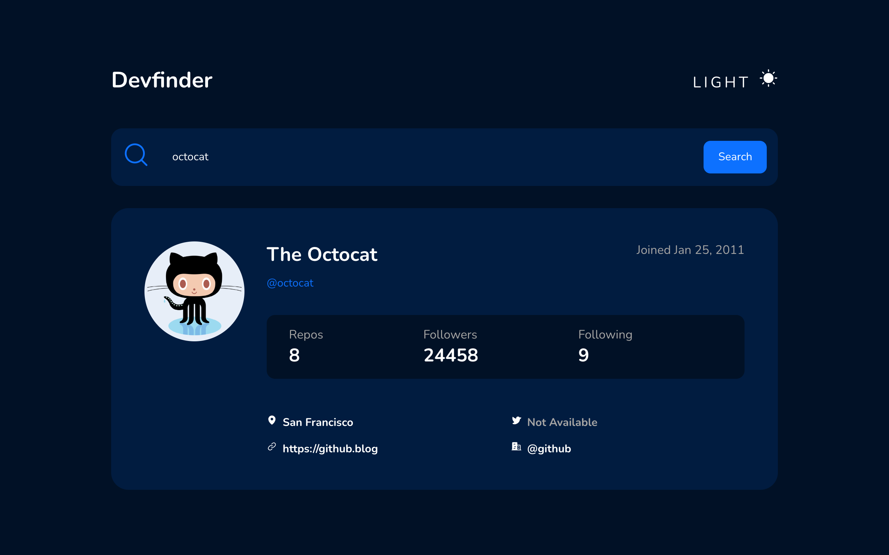
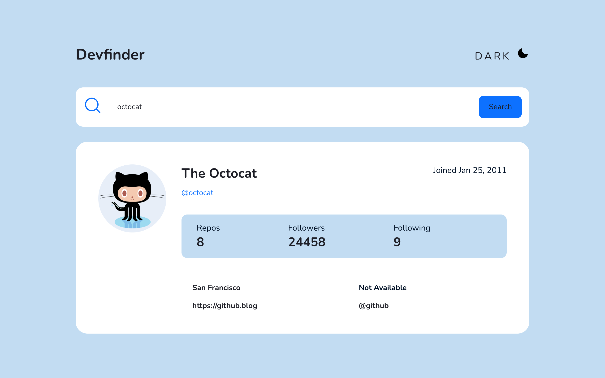
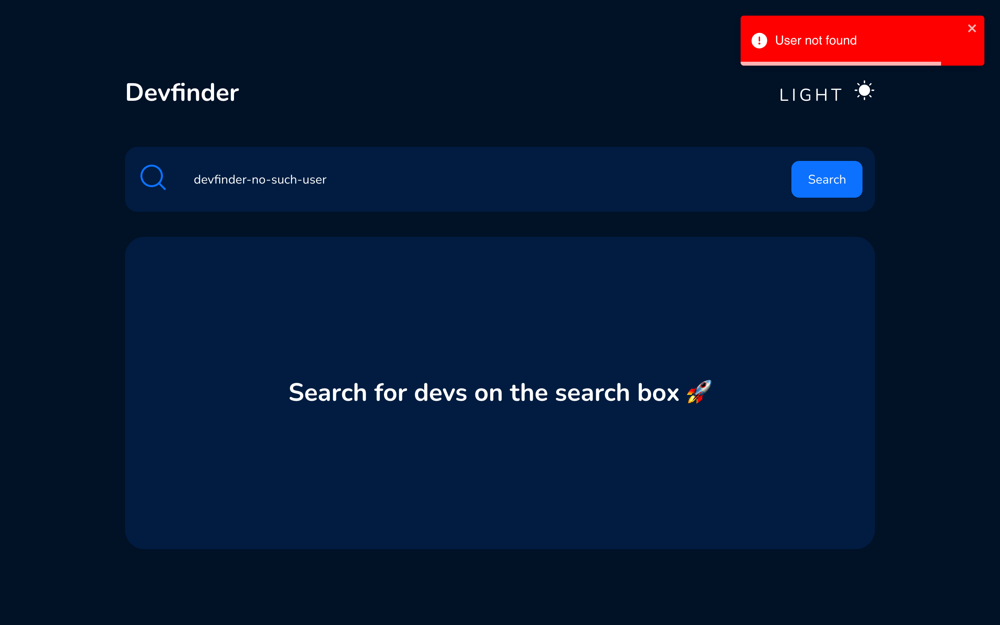
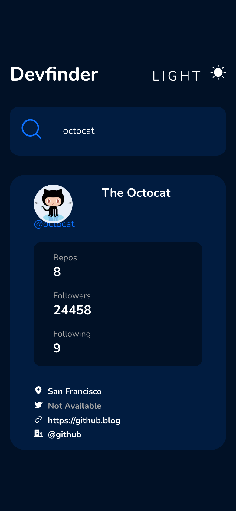

# Devfinder

**English** · [Português](README.pt-BR.md)

> Type a GitHub username and see that developer's public profile on a card, in a dark or light theme.

**Live demo:** [dev-finder-woad.vercel.app](https://dev-finder-woad.vercel.app)



## About

Devfinder is a single-page React app that looks up a user on the public GitHub REST API (`GET /users/{username}`) and lays the answer out as a profile card. There is no backend: the browser calls the API directly, with no token and nothing to configure. It was written in March 2023 with React, TypeScript and styled-components.

## Features

- **Search by username** — type a username and press **Search**. On narrow screens the button is hidden and the magnifier icon runs the search instead.
- **Profile card** — avatar, name, join date, `@username`, bio, the number of public repositories, followers and following, plus location, Twitter handle, website and company.
- **Missing fields** — when the API returns `null` for location, Twitter, website or company, the card shows "Not Available" instead.
- **Dark and light themes** — switch from the header; the choice is saved in `localStorage` and survives a reload.
- **Error toast** — a failed lookup shows a "User not found" toast for three seconds.
- **Responsive layout** — below 500 px wide the stats and links on the card stack into a single column.

## Screenshots

| Light theme | Unknown username |
| --- | --- |
|  |  |

On a phone (390 px wide):



## Tech stack

- **Frontend:** React 18, TypeScript 4, Vite 4
- **Styling:** styled-components 5 (theme provider for the dark and light themes)
- **Libraries:** axios (GitHub API client), react-toastify (error toast), phosphor-react (icons)
- **Linting:** ESLint 8 with `@rocketseat/eslint-config`

## Getting started

### Prerequisites

- Node.js and npm (tested with Node.js 24)

### Installation

```bash
git clone https://github.com/giovaniocan/devFinder.git
cd devFinder
npm install
npm run dev
```

Open http://localhost:5173.

To build for production and serve the build locally:

```bash
npm run build
npm run preview
```

The app calls the GitHub API without a token, so GitHub's limit for unauthenticated requests applies. Once it is reached, searches fail and show the same "User not found" toast until the limit resets.
